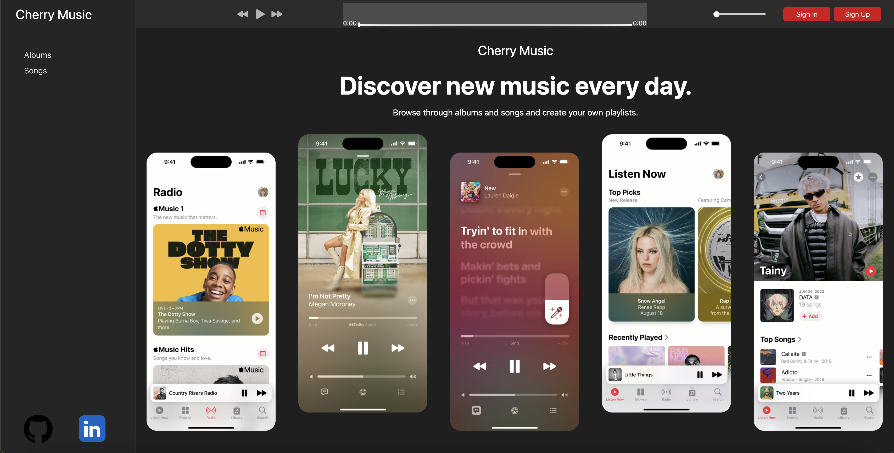

# Cherry Music

Cherry Music is a clone of Apple Music, providing a seamless music streaming experience. Key features include albums, playlists, a dynamic playbar, and a search functionality.

[Cherry Music](https://cherry-music.onrender.com/)



## Technologies Used

- **Frontend:** React, Redux, CSS
- **Backend:** Ruby on Rails
- **Database:** PostgreSQL
- **Cloud Services:** AWS

## Key Features

### Music Player Controls

The following JavaScript code provides functions for controlling a music player in a React application:

- `next`: Advances to the next song in the queue if available.
- `previous`: Goes to the previous song in the queue if available.
- `play`: Initiates playback of the current song or restarts from the beginning.
- `pause`: Pauses the currently playing song.

These functions are commonly used in a music player application to manage the playback flow and user interaction.


```javascript
const next = () => {
    if (currentSongIndex < queue.length - 1) {
        setCurrentSongIndex(currentSongIndex + 1);
    }
}

const previous = () => {
    if (currentSongIndex > 0) {
        setCurrentSongIndex(currentSongIndex - 1);
    }
}

const play = () => {
    if (currentSong) {
        audioRef.current.currentTime = audioRef.current.currentTime || 0;
        dispatch(playSong());
    }
};

const pause = () => {
    dispatch(pauseSong());
}
```

### Creating Playlists

Users can personalize their music experience by creating and managing playlists. The implementation includes CRUD operations for playlists, ensuring a tailored and consistent playlist experience across devices.

This code snippet is part of a Redux reducer handling actions related to adding or removing songs from playlists in a music app.

```javacript
case ADD_SONG_TO_PLAYLIST: 
        const { playlistId, songId } = action.payload;
        const playlistToUpdate = newState[playlistId];
        if (playlistToUpdate) {
            const updatedPlaylist = {
                ...playlistToUpdate,
                playlistSongs: [...playlistToUpdate.playlistSongs, songId],
            };
            return {
                ...newState,
                [playlistId]: updatedPlaylist,
            };
        }
        return newState;
case REMOVE_SONG_FROM_PLAYLIST: 
        const playlist = {...newState[action.payload.playlistId]}

        playlist.playlistSongs = playlist.playlistSongs.filter((id) => id !== action.payload.songId)
        playlist.playlistSongIds = playlist.playlistSongIds.filter((id) => id !== action.payload.playlistSongId)

        const updatedState =  {
            ...newState, [action.payload.playlistId]: playlist,
        };

        return updatedState;
```

### To add a song to a playlist: 
* It extracts playlistId and songId from the action payload.
* It checks if the playlist with playlistId exists in the current state (newState).
* If the playlist exists, it creates an updated playlist with the new song added to the playlistSongs array.

### To delete a song from a playlist: 

* It creates a copy of the playlist object using the playlistId from the action payload.
* It filters out the specified songId from both playlistSongs and playlistSongIds arrays in the playlist.
* The updated state is returned with the modified playlist.


## Conclusion

Cherry Music delivers a feature-rich music streaming experience, combining the elegance of Apple Music with the flexibility of a custom-built solution. The use of React, Redux, Ruby on Rails, PostgreSQL, and AWS showcases a harmonious synergy between frontend, backend, database, and cloud technologies, providing users with a seamless and enjoyable music platform.

